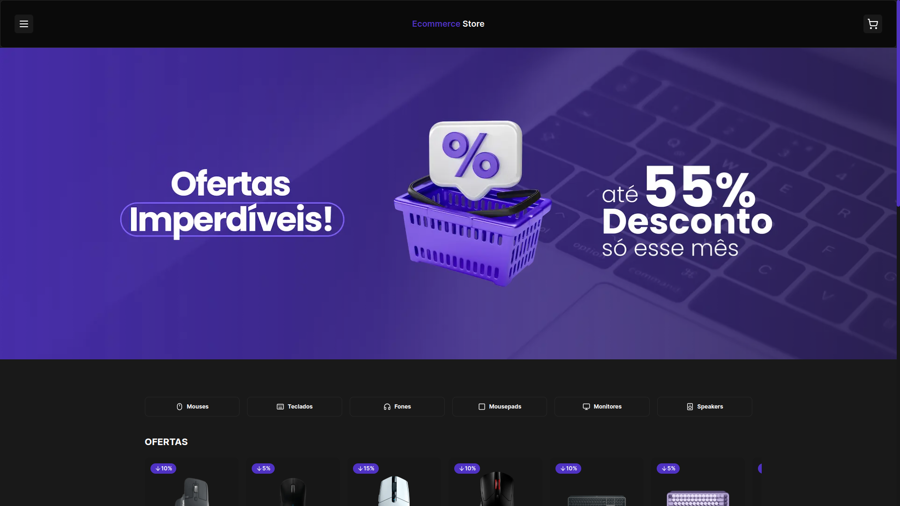
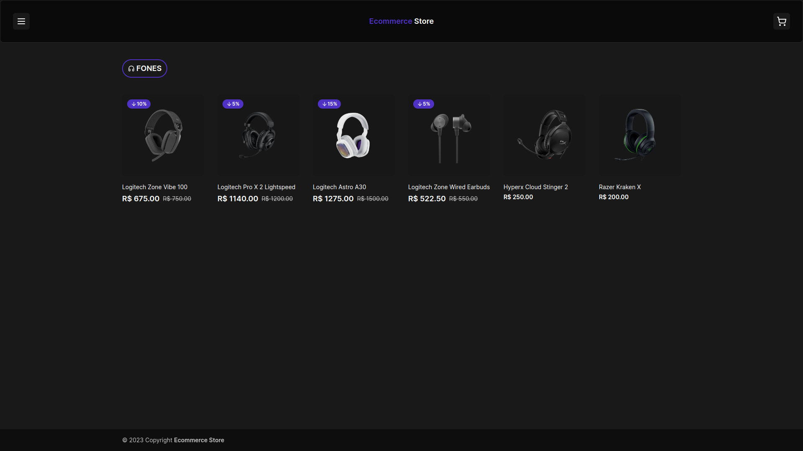
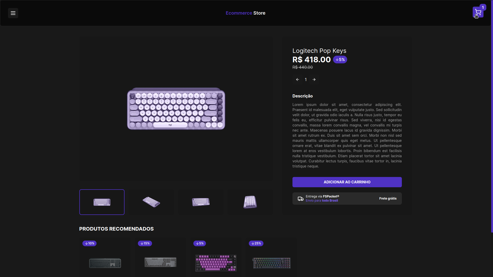
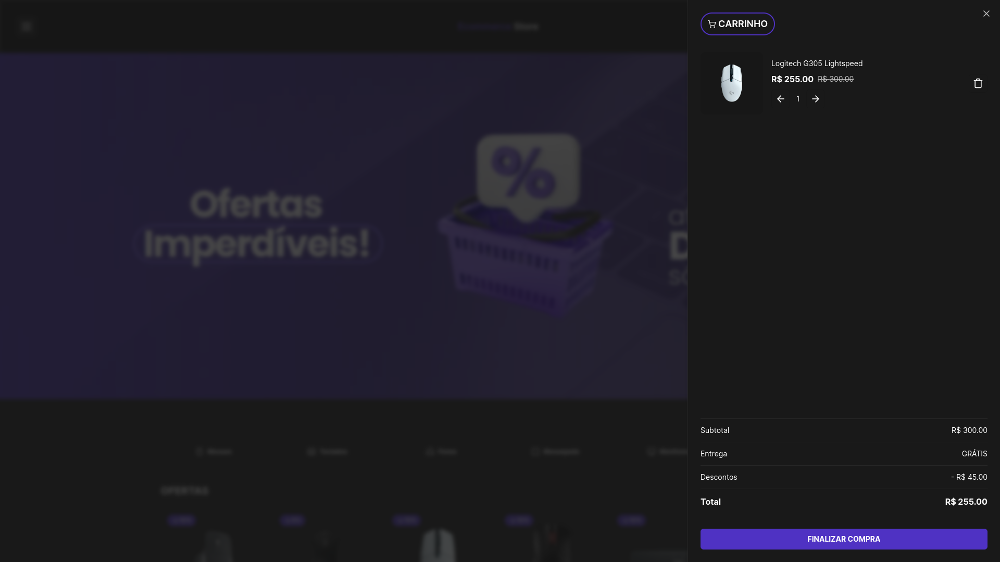
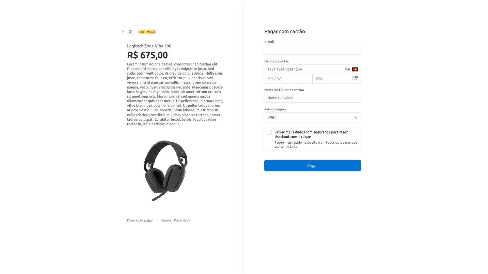

<h1 align="center"> Ecommerce Store </h1>

Loja modelo e-commerce de tecnologia. 

  <a href="#🚀-tecnologias">Tecnologias</a>&nbsp;&nbsp;&nbsp;|&nbsp;&nbsp;&nbsp;
  <a href="#💻-funcionalidades-do-projeto">Projeto</a> 

 

  

    
  

  

## 🚀 Tecnologias:

Esse projeto foi desenvolvido com as seguintes tecnologias:

  - **React**

  - **Next.js 13**

  - **Tailwind CSS**

  - **Next Auth** (Biblioteca para autenticação de usuários com OAuth)

  - **Postgres** (Um sistema de gerenciamento de banco de dados relacional.)

  - **Prisma** (Um ORM (Object-Relational Mapping) para Node.js e TypeScript.)

  - **shadcn/ui** (Uma biblioteca de componentes.)

  - **API do Stripe** (Uma API de pagamento.)

## 💻 Funcionalidades do projeto:

   

   - **Login com o Google:**
  

    
  

  - **Navegação por Categorias:**
   

    
  

  - **Descontos em Produtos:**
   

    
  

  
  - **Gerenciamento do Carrinho de Compras:**
  

    
  

  - **Pagamento do Pedido com a API do Stripe:**
  

    
  

## 

